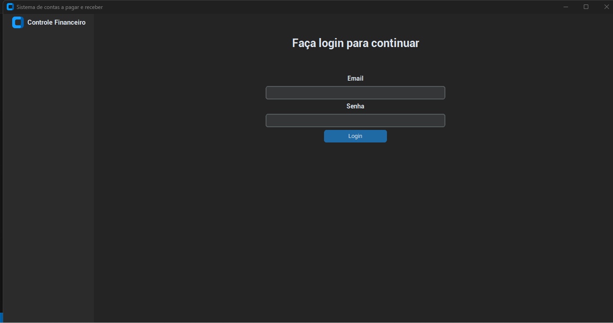
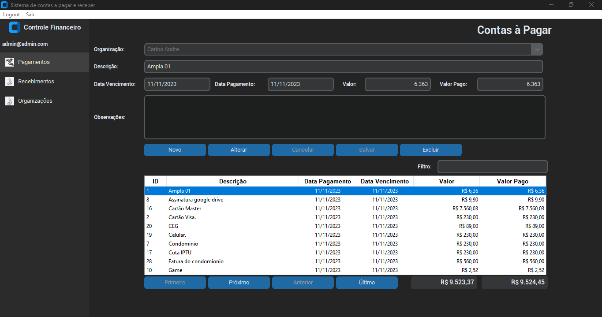
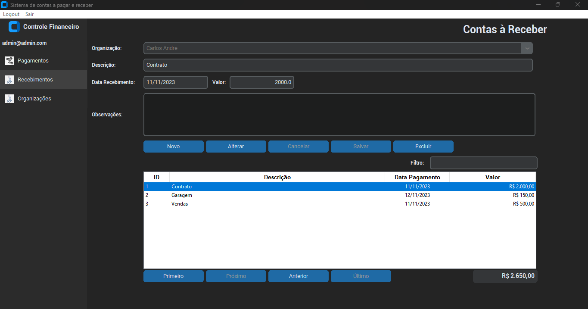
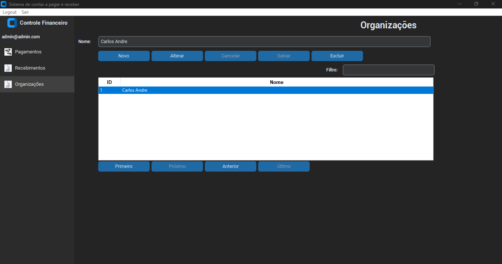
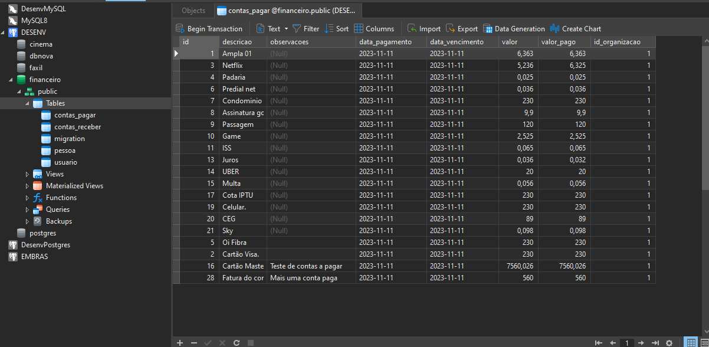
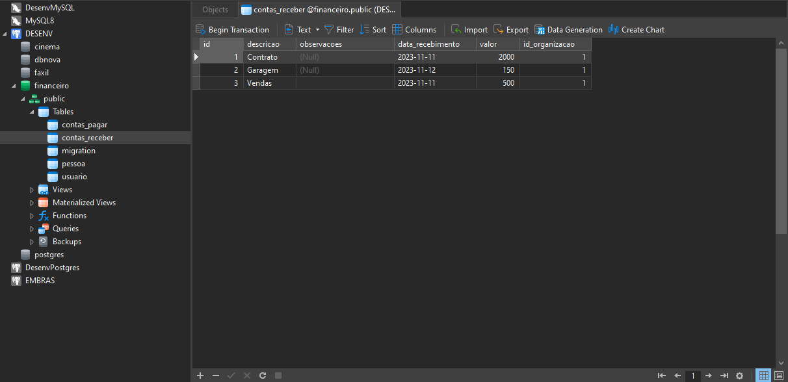
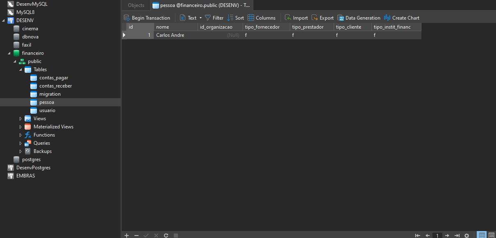
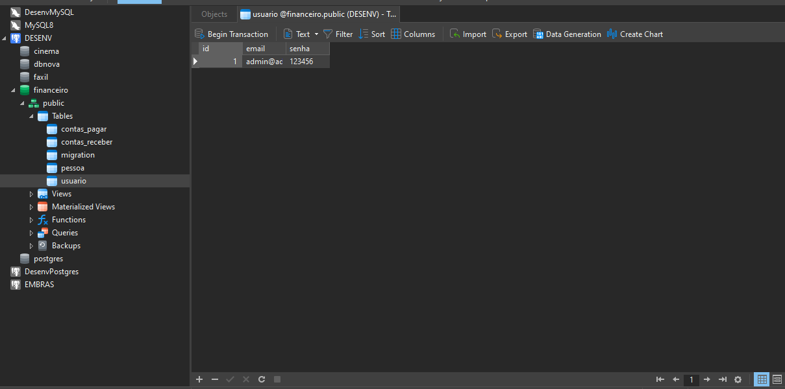
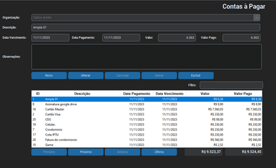

## Documentações
### [Requisitos do Sistema](./Docs/Requisitos.pdf)
## Instalação
Requer python 3.11
### Bibliotecas
Bibliotecas necessárias para executar o sistema

```sh
pip install customtkinter
pip install tkinter
pip install CTkToolTip
pip install Pillow
pip install psycopg2
pip install python-dotenv
```
### Configurações
- No arquivo .env altere os parâmetros de banco de dados

### Executar
- Na pasta do programa digite:
```sh
python app.py
```
### Telas do Sistema
#### Login
- Uma tela de login será apresentada solicitando o seu email e senha, caso seja a primeira execução do sistema entre com um email e senha qualquer
- Se as configurações com o banco de dados estiverem corretas o sistema vai gerar automaticamente todas as tabelas necessárias
- Em seguida uma conta de acesso será criada com o email e senha informados anteriormente, liberando o acesso ao sistema.



#### Cadastrar Contas à Pagar
- Tela de lançamentos das contas à pagar, as contas são cadastradas por organização
- 

#### Cadastrar Contas à Receber
- Tela de lançamentos das contas à receber, as contas são cadastradas por organização
- 

#### Cadastrar de Organizações
- Tela de cadastro das organizações de controle financeiro
- 


### Prints das tabelas no BD
#### Tabela de Contas a Pagar
- 


#### Tabela de Contas a Receber
- 
  

#### Tabela de Organizações
- 

#### Tabela de Usuários
- 


## Vídeo de Demonstração
[](https://youtu.be/YP4GqdUU0Q8)